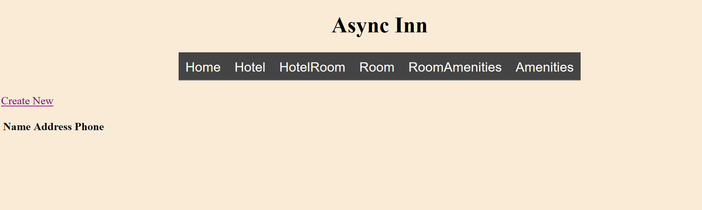
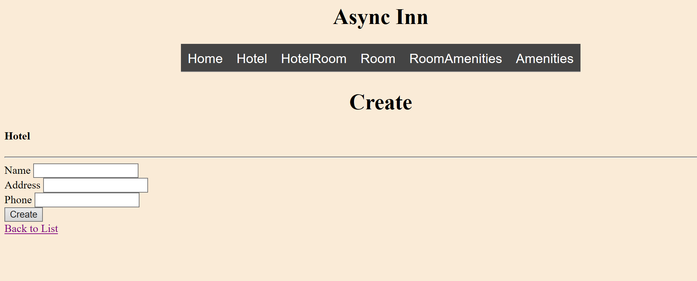
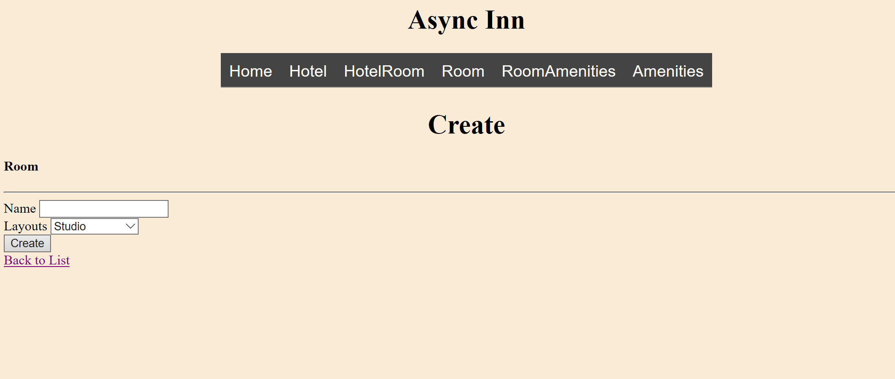
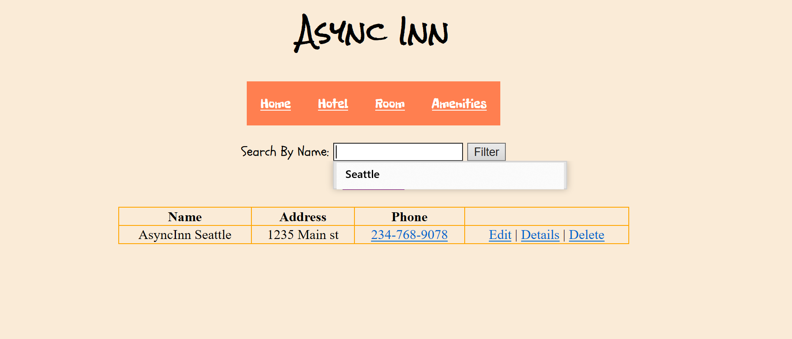
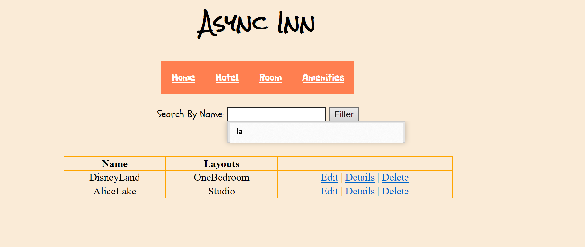
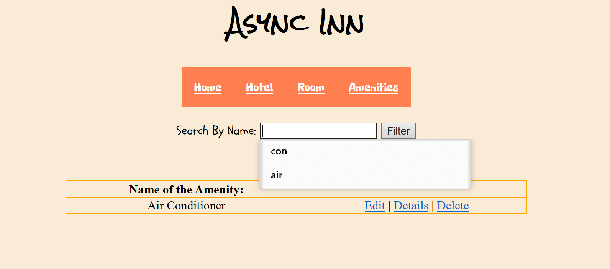

# AsyncInn

 This add has been deployed on Azure:
 
 https://asyncinn20190201061112.azurewebsites.net/

#Summary

Creating my initial MVC application for your Hotel management system.

Using database schema, convert each entity into a model within your newly created MVC web application.

Following the steps provided, in addition to what we did in class, create a new DbContext named AsyncInnDbContext. Within this DbContext, declare Database tables and set the composite keys.

#Steps and Visual

The very first page is the Home page:

You can see there is a navigation bar at the top , this will be showed on each page. 
And then if you choose Hotel on the navi bar, you will see :

Then you click create, it will navigate you to the create a new hotel page:

And all the other tags have same function, for Room page, when you click "create",  you will see a dropdown list on the page, it came from enum:

#search bar

You can type in keywords you like to search Hotel/Room/Amenities

#Reference

The web app is based on following database schema:

